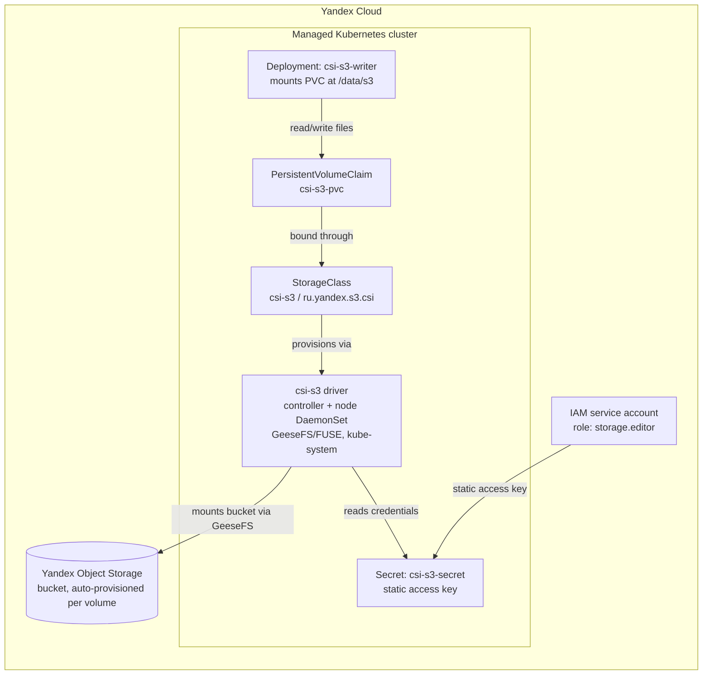

# kubernetes-csi: CSI-driven Object Storage for Kubernetes pods

Homework for the "Инфраструктурная платформа на основе Kubernetes" course
(assignment brief: `docs/README.md`). Installs and configures the
[yandex-cloud/k8s-csi-s3](https://github.com/yandex-cloud/k8s-csi-s3) CSI
driver (provisioner `ru.yandex.s3.csi`) in a Yandex Managed Kubernetes
cluster so pods can mount Yandex Object Storage buckets as
`PersistentVolume`s, and demonstrates a workload that writes through that
mount into real object storage.

## Architecture



## What's in this folder

| Path | Purpose |
| --- | --- |
| `k8s/namespace.yaml` | Namespace for the demo workload (`csi-s3-demo`) |
| `k8s/secret.example.yaml` | Structure of the `csi-s3-secret` the driver reads -- **never fill in real keys and commit them** |
| `k8s/storageclass.yaml` | `StorageClass` using provisioner `ru.yandex.s3.csi`, dynamic (autoProvisioning) bucket-per-volume |
| `k8s/pvc.yaml` | `PersistentVolumeClaim` requesting the `csi-s3` class, `ReadWriteMany` |
| `k8s/deployment.yaml` | Hardened `Deployment` mounting the PVC at `/data/s3` and appending a heartbeat line every 5s to prove writes land in the bucket |
| `helm/csi-s3-values.yaml` | Values for installing the driver itself via the official Helm chart |
| `docs/cloud/README.md` | Detailed Yandex Cloud administrator guide (cluster, bucket, IAM key, driver install, verification, teardown) |
| `checklist/README.md` | Requirement-by-requirement self-assessment |
| `IMPLEMENTATION_REPORT.md` | What was verified in this sandbox vs. what needs a live cluster |
| `scripts/validate_k8s.sh` | Static validation entry point (yamllint, kubeconform, pytest) |
| `tests/test_manifests.py` | Structural tests on the manifests above |

## Demo script (for the recorded walkthrough)

1. Show `docs/cloud/README.md` section 4 (bucket + IAM key already created) and
   `kubectl get storageclass csi-s3` to prove the driver is installed.
2. `kubectl apply -f k8s/namespace.yaml -f k8s/secret.example.yaml -f k8s/pvc.yaml -f k8s/deployment.yaml`
   (with `k8s/secret.example.yaml` filled in with real keys locally, never committed).
3. `kubectl get pvc -n csi-s3-demo csi-s3-pvc` -- show `STATUS: Bound`.
4. `kubectl exec -n csi-s3-demo deploy/csi-s3-writer -- tail -f /data/s3/heartbeat.log`
   -- show new lines appearing every 5s.
5. In the Yandex Cloud console (or `yc storage s3api list-objects-v2 --bucket <auto-generated-name>`),
   show `heartbeat.log` present in the bucket with a matching, growing size.
6. Delete the PVC and show the auto-provisioned bucket disappearing
   (`reclaimPolicy: Delete` in `k8s/storageclass.yaml`).
7. Tear down the cluster per `docs/cloud/README.md` section 6 to stop billing.

## Local validation

```bash
pip install pyyaml pytest yamllint
bash scripts/validate_k8s.sh
```

See `IMPLEMENTATION_REPORT.md` for exactly what has and hasn't been run.
