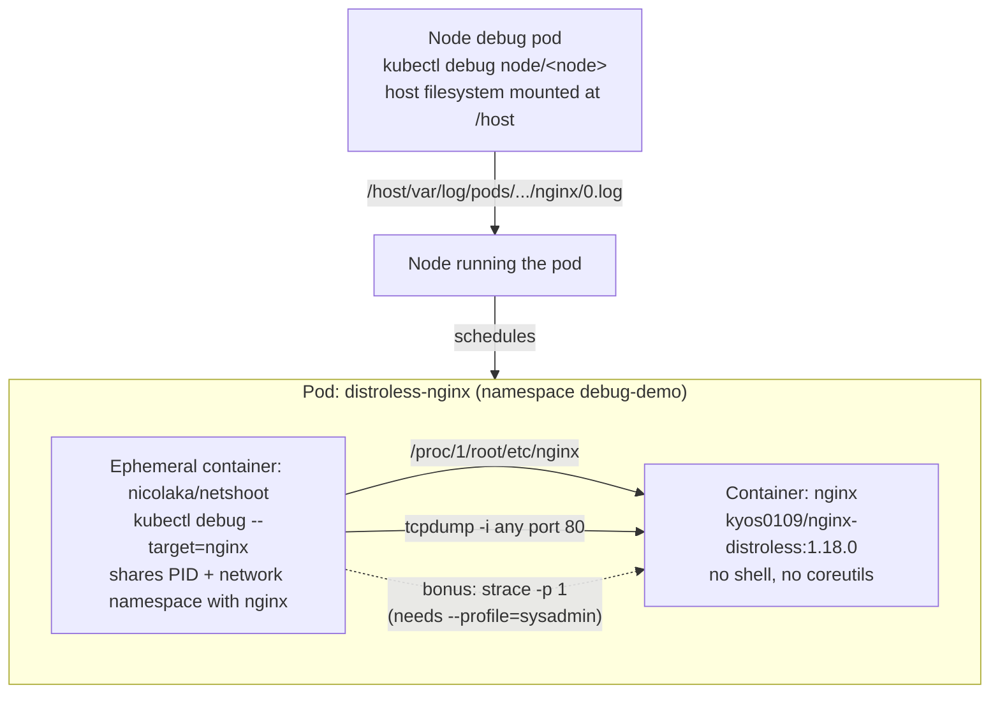

# kubernetes-debug: debugging a distroless container with kubectl debug

Homework for the "Инфраструктурная платформа на основе Kubernetes" course
(assignment brief: `docs/README.md`). Demonstrates debugging a
shell-less/tool-less (distroless) container using ephemeral containers and
`kubectl debug`, without modifying or restarting the target pod.

## Architecture



## What's in this folder

| Path | Purpose |
| --- | --- |
| `k8s/namespace.yaml`, `k8s/pod-distroless-nginx.yaml` | The distroless target pod + Service |
| `scripts/debug_session.sh` | Exact, ordered commands for every assignment step, including the bonus (`*`) strace task |
| `checklist/README.md` | What's done, how to run it, how to verify -- same format as the other homeworks in this repo |
| `IMPLEMENTATION_REPORT.md` | Why this folder ships a runbook instead of captured terminal output, and exactly what to run to produce that evidence yourself |

## Why ephemeral containers, not `kubectl exec`

`kyos0109/nginx-distroless` has no shell, so `kubectl exec -it ... -- sh`
fails outright. `kubectl debug <pod> --target=nginx --image=nicolaka/netshoot`
attaches a new, throwaway container to the *running* pod that joins the
target container's process namespace (via `--target`) and automatically
shares its network namespace (all containers in a pod always do) --
without ever restarting `distroless-nginx` or needing a shell inside it.

## Demo script (for the recorded walkthrough)

Follow `scripts/debug_session.sh` in order:

1. Apply `k8s/pod-distroless-nginx.yaml`, show it `Running`.
2. `kubectl debug -it distroless-nginx -n debug-demo --image=nicolaka/netshoot --target=nginx -- bash`.
3. Inside the ephemeral container: `ls -la /proc/1/root/etc/nginx` -- shows the distroless container's config directory from the outside.
4. `tcpdump -nn -i any -e port 80` in the ephemeral container, then generate traffic from a second terminal/pod and show captured packets.
5. Bonus: re-attach with `--profile=sysadmin` (grants `CAP_SYS_PTRACE`) and run `strace -p 1` against the nginx master process.
6. `kubectl debug node/<node> -it --image=busybox`, then read the pod's log straight off the node filesystem at `/host/var/log/pods/debug-demo_distroless-nginx_<uid>/nginx/0.log`.

## Local validation

```bash
pip install pyyaml pytest
pytest tests -q
```

Confirms the manifests parse and match the assignment (pinned distroless
image, no shell-dependent probes, resource limits present). It cannot
confirm the live-debugging behavior itself -- that needs a real cluster;
see `IMPLEMENTATION_REPORT.md`.
