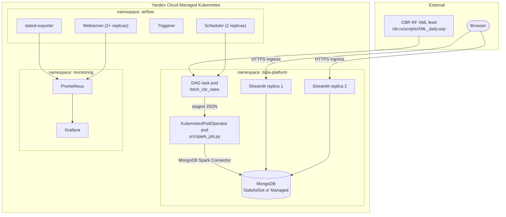

# kubernetes-demo

HA Apache Airflow on Yandex Cloud Managed Kubernetes, running a daily DAG
that fetches USD/EUR/CNY exchange rates from the Central Bank of Russia,
processes them with PySpark, persists them to MongoDB, and serves them
through a Streamlit landing page with a simple 5-working-day forecast.
Built on top of the assignment brief in `docs/README.md`.

## Architecture



## Repository layout

```
kubernetes-demo/
├── dags/                 Airflow DAG (fetch + orchestrate)
├── src/                  Shared Python: CBR client, forecast, Mongo repo, Spark job
├── streamlit_app/        Landing page (rates + forecast) + Dockerfile
├── airflow/              Helm values (base/dev/prod) + chart install notes
├── k8s/                  Namespaces, Secrets template, RBAC, NetworkPolicy,
│                         Streamlit + MongoDB manifests
├── monitoring/           Prometheus/Grafana values + dashboard JSON
├── tests/                unit / integration / security / k8s test suites
├── docs/cloud/README.md  Yandex Cloud step-by-step admin guide
├── checklist/README.md   Requirement-by-requirement self-assessment
└── IMPLEMENTATION_REPORT.md   What was verified vs. not, and why
```

`.github/workflows/kubernetes-demo-ci.yml` lives at the repository root
(not under `kubernetes-demo/`) because GitHub Actions only discovers
workflow files under a repo-root `.github/workflows/` directory; this is
the one intentional exception to keeping all changes inside
`kubernetes-demo/`.

## Quick start (local, no Kubernetes)

```bash
cd kubernetes-demo
cp .env.example .env   # fill in MONGO_ROOT_PASSWORD before running compose
python3 -m venv .venv && source .venv/bin/activate
pip install -r requirements-dev.txt
pytest tests/unit tests/integration tests/security tests/k8s -v
docker compose up --build   # MongoDB + Streamlit at http://localhost:8501
```

The DAG itself needs a real Airflow environment (KubernetesExecutor); it is
not runnable via `docker compose` alone. See `docs/cloud/README.md` for the
full cluster + Helm install path, and `IMPLEMENTATION_REPORT.md` for what
could and could not be exercised in this sandbox.

## Forecast disclaimer

The "forecast" on the Streamlit page is the arithmetic mean of the rate
over the last 5 working days actually stored in MongoDB. It is **not**
machine learning and makes no claim about future accuracy or direction. If
fewer than 5 working days of history exist, the page shows "Недостаточно
исторических данных" instead of a number.

## Demo video script (~3 minutes)

1. **0:00–0:20** — Show `docs/README.md` (assignment brief) and this
   README's architecture diagram; state the goal in one sentence.
2. **0:20–1:00** — `kubectl get pods -n airflow` showing 2 scheduler + 2
   webserver replicas Running; open the Airflow UI, show the
   `cbr_rates_pipeline` DAG's task graph and a successful run.
3. **1:00–1:40** — `kubectl logs` on the `spark_process_and_load` task pod,
   showing schema validation and the MongoDB write; then a `mongosh` query
   against the `rates` collection showing today's USD/EUR/CNY rows.
4. **1:40–2:20** — Open the Streamlit page: current rates table, forecast
   table, and the disclaimer text. Trigger a DAG re-run for the same date
   and show the row count in Mongo is unchanged (idempotency).
5. **2:20–2:50** — Open Grafana, show the DAG-run and task-duration panels
   updating after the re-run.
6. **2:50–3:00** — Close on `checklist/README.md`, noting what is verified
   vs. what requires a real cloud account (per `IMPLEMENTATION_REPORT.md`).

## Explicit non-goals / prohibitions honored

- No `latest` image tags anywhere (enforced by `tests/k8s/test_manifests.py`).
- No root/privileged containers, no `cluster-admin`, no GPU resources.
- No fabricated Prometheus metrics -- all panels read real Airflow/K8s metrics.
- No secrets committed -- only `*.example.yaml` templates and `.env.example`.
- No tests disabled or removed to make CI pass.
