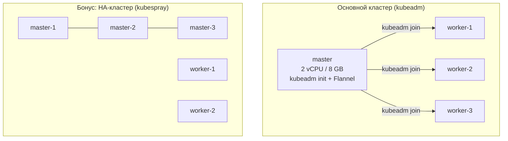

# kubernetes-prod: kubeadm cluster build + upgrade (+ kubespray HA bonus)

Homework for the "Инфраструктурная платформа на основе Kubernetes" course
(assignment brief: `docs/README.md`). Builds a Kubernetes cluster from
scratch with `kubeadm` on 4 VMs, upgrades it one minor version with zero
unplanned downtime (sequential cordon/drain/upgrade/uncordon), and
optionally builds a second, separate HA cluster with `kubespray`.

## Architecture



## What's in this folder

| Path | Purpose |
| --- | --- |
| `scripts/00-common-prep.sh` | Node prep run on every VM: disable swap, kernel modules/sysctl, install containerd + kubeadm/kubelet/kubectl |
| `scripts/01-master-init.sh` | `kubeadm init` + Flannel install on the master, prints the join command |
| `scripts/02-worker-join.sh` | `kubeadm join` on each worker |
| `scripts/03-upgrade-master.sh` | Control-plane upgrade via `kubeadm upgrade` |
| `scripts/04-upgrade-worker.sh` | Per-worker cordon → drain → `kubeadm upgrade node` → uncordon, run one worker at a time |
| `kubespray/inventory/hosts.yaml` | Bonus (*) inventory template for a 3-master/2-worker HA cluster |
| `kubespray/README.md` | How to run kubespray against that inventory |
| `docs/cloud/README.md` | Russian admin guide: creating the 4 (or 9, with the bonus) Yandex Cloud VMs, running the scripts in order, teardown |
| `checklist/README.md`, `IMPLEMENTATION_REPORT.md` | Requirement tracking and an honest verified/not-verified breakdown |

## Demo script (for the recorded walkthrough)

1. Create 4 VMs per `docs/cloud/README.md` §4.
2. Run `00-common-prep.sh` on all 4.
3. Run `01-master-init.sh` on the master; capture the join command.
4. Run `02-worker-join.sh` on each of the 3 workers.
5. `kubectl get nodes -o wide` — capture output (required deliverable #1).
6. Run `03-upgrade-master.sh`, then `04-upgrade-worker.sh` for each worker one at a time.
7. `kubectl get nodes -o wide` again — capture output (required deliverable #2), now showing the new version.
8. (Bonus) create 5 more VMs, fill in `kubespray/inventory/hosts.yaml` with real IPs, run kubespray per `kubespray/README.md`, capture `kubectl get nodes -o wide` and attach the inventory file used.

## Local validation

```bash
pip install pyyaml pytest
pytest tests -q
```

Checks the scripts and inventory are internally consistent (pinned
versions, correct sequencing, inventory groups match kubespray's
expectations). It cannot confirm a real cluster comes up -- that needs
real VMs; see `IMPLEMENTATION_REPORT.md`.
